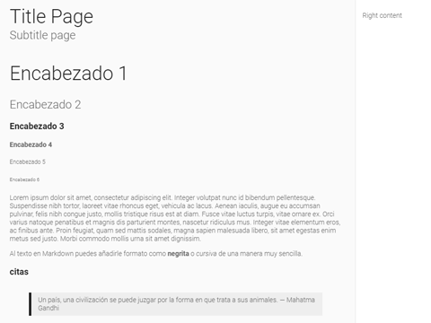

# \<app-page\>

`app-page` shows a structure of page with the option of add a markdown file inside for show all information in a page.



## Installing the component

- For install it, clone the repository in your local machine

```
  $ git clone https://github.com/adominguez/app-page.git
```

- Do a npm install and bower install

```
  $ npm install && bower install
``` 

## Serving the component

You can serve the component with:

```
  $ gulp serve
```

__Example__

```html
<app-page title-page="blog" subtitle-page="Marked publications" fade-in></app-page>
```

__markdown file Example__

```html
<app-page readme="https://raw.githubusercontent.com/PolymerElements/polymer-starter-kit/master/README.md" title-page="blog" subtitle-page="Marked publications" fade-in></app-page>
```

__Responsive example__

```html
<app-page title-page="Contact" subtitle-page="contact with us" responsive fade-in></app-page>
```

This component is responsive at 960px. Then the right content goes down in the page

## Slot

This component has three `slot`:

| slot               | function                               |
|:------------------ | --------------------------------------:|
| left-content       | Show the information in the page       |
| left-content-down  | Show information down of left-content  |
| right-content      | Show the right sidebar                 |

## Styling
The following custom properties and mixins are available for styling:

| Custom property                              | Description                                         | Default |
|:-------------------------------------------- |:--------------------------------------------------- | -------:|
| --app-page-first-color                       | color for first color                               | #212121 |
| --app-page-second-color                      | color for second color                              | #666    |
| --app-page-blockquote-bg-color               | background color for blockquote                     | #eeeeee |
| --app-page-h1                                | empty mixin for h1                                  | {}      |
| --app-page-h2                                | empty mixin for h2                                  | {}      |
| --app-page-h3                                | empty mixin for h3                                  | {}      |
| --app-page-h4                                | empty mixin for h4                                  | {}      |
| --app-page-h5                                | empty mixin for h5                                  | {}      |
| --app-page-h6                                | empty mixin for h6                                  | {}      |
| --app-page-p                                 | empty mixin for p                                   | {}      |
| --app-page-blockquote                        | empty mixin for blockquote                          | {}      |
| --app-page-blockquote-p                      | empty mixin for blockquote p                        | {}      |
| --app-page-code                              | empty mixin for code                                | {}      |
| --app-page-list                              | empty mixin for list                                | {}      |
| --app-page-list-li                           | empty mixin for list li                             | {}      |
| --app-page-link-color                        | color for link                                      | #FF4081 |
| --app-page-link                              | empty mixin for link                                | {}      |
| --app-page-link-hover-color                  | color for link hover                                | #212121 |
| --app-page-link-hover                        | empty mixin for link hover                          | {}      |
| --app-page-link-visited                      | empty mixin for link visited                        | {}      |
| --app-page-card                              | empty mixin for card                                | {}      |
| --app-page-bg-color                          | background for host                                 | #fafafa |
| --app-page                                   | empty mixin for host                                | {}      |
| --app-page-panel-right-width                 | width for panel right                               | 200px   |
| --app-page-panel-left                        | empty mixin for panel-left                          | {}      |
| --app-page-title                             | empty mixin for title                               | {}      |
| --app-page-subtitle                          | empty mixin for sutitle                             | {}      |
| --app-page-title-left-content                | empty mixin for left content                        | {}      |
| --app-page-panel-right-b-l-color             | border left for panel-right                         | #e5e5e5 |
| --app-page-panel-right-bg-color              | background color for panel-right                    | #fff    |
| --app-page-panel-right                       | empty mixin for panel-right                         | {}      |
| --app-page-title-right-content               | empty mixin for right-content                       | {}      |
| --app-page-hide-panel-right                  | empty mixin for host([hide-panel-right])            | {}      |
| --app-page-hide-panel-right-panel-left       | empty mixin for host([hide-panel-right]) panel-left | {}      |
| --app-page-responsive                        | empty mixin for host([responsive])                  | {}      |
| --app-page-responsive-panel-left             | empty mixin for host([responsive]) panel-left       | {}      |
| --app-page-responsive-panel-right-b-t-color  | border top for host([hide-panel-right]) panel-right | #e5e5e5 |
| --app-page-responsive-panel-right            | empty mixin for host([responsive]) panel-right      | {}      |
